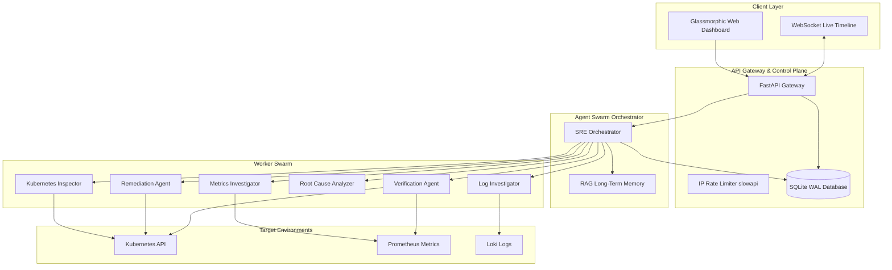
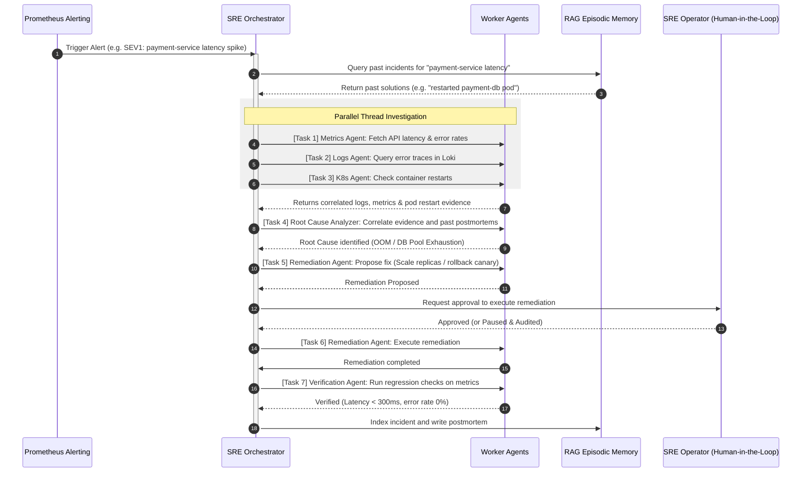

# AIRE: Autonomous Incident Response Engineer Platform

AIRE is a production-grade autonomous Site Reliability Engineering (SRE) control plane. It behaves like an experienced SRE agent at scale, detecting outages, querying Loki logs and Prometheus metrics, executing safe container remediations, compiling postmortems, and scoring performance through a dedicated evaluation pipeline.

---

## 🏛️ Comprehensive Engineering Documentation

The repository has been evolved into a professional engineering portfolio. Review the detailed architecture, system design, security, and AI reasoning specifications:

* **[ARCHITECTURE.md](file:///C:/Users/KALYAN/.gemini/antigravity/scratch/aire/docs/architecture/ARCHITECTURE.md)**: Specifies module boundaries, SQLAlchemy WAL database integration, and thread-pool execution wrappers.
* **[SYSTEM_DESIGN.md](file:///C:/Users/KALYAN/.gemini/antigravity/scratch/aire/docs/system_design/SYSTEM_DESIGN.md)**: Outlines horizontally scalable infrastructure upgrades to support 1M+ active users using RabbitMQ, Redis PubSub, and read replicas.
* **[PROMPT_ENGINEERING.md](file:///C:/Users/KALYAN/.gemini/antigravity/scratch/aire/docs/ai/PROMPT_ENGINEERING.md)**: Details SRE Prompt designs, structured JSON configurations, hybrid RAG memory lookup, and golden-dataset scoring metrics.
* **[SECURITY.md](file:///C:/Users/KALYAN/.gemini/antigravity/scratch/aire/docs/security/SECURITY.md)**: Documents the platform threat model, secrets redaction filters, and RBAC matrix.
* **[INTERVIEW_PREP.md](file:///C:/Users/KALYAN/.gemini/antigravity/scratch/aire/docs/interviews/INTERVIEW_PREP.md)**: Features 100 hard systems, concurrency, and AI questions with model answers and hiring committee simulation feedback.

---

## 🏛️ System Architecture Diagram



---

## 🤖 Collaborative Agent Swarm Sequence



---

## 📂 Project Directory Structure

```text
aire/
├── backend/
│   ├── main.py              # FastAPI application, health checks, rate limits, static mount
│   ├── core/
│   │   ├── config.py        # Global settings, model identifiers
│   │   ├── security.py      # RBAC authorizer, prompt injection validator, secrets redaction
│   │   └── models.py        # SQLAlchemy ORM schemas, database engine configurations
│   ├── agents/
│   │   ├── orchestrator.py  # SRE Orchestrator thread-safe workflow driver
│   │   ├── swarm.py         # Sub-agents (Log, Metric, K8s, Root Cause, Remediation)
│   │   └── tools.py         # SRE Client integrations (Prometheus, Loki, K8s)
│   ├── memory/
│   │   ├── rag.py           # Incident history memory search context lookup
│   │   └── episodic.py      # Past incident memory registers
│   ├── simulation/
│   │   ├── mock_services.py # Mock timeseries data generators
│   │   └── incident_generator.py # Simulators for PodCrash, DBLeak, LatencySpike
│   ├── evaluation/
│   │   └── evaluator.py     # Ground truth evaluations scoring engine
│   └── tests/
│       └── test_sre.py      # Automated testing suite (WAL, rate limits, lifecycles)
├── frontend/
│   ├── index.html           # Dark glassmorphic control center dashboard
│   ├── style.css            # Dark variable grids and layout overrides
│   └── app.js               # Websocket state managers and click handlers
├── docs/                    # Evolved System Engineering specs directory
│   ├── architecture/        # ARCHITECTURE.md spec sheet
│   ├── system_design/       # SYSTEM_DESIGN.md scaling plans
│   ├── ai/                  # PROMPT_ENGINEERING.md evaluation logs
│   ├── security/            # SECURITY.md threat models
│   ├── interviews/          # INTERVIEW_PREP.md model answers
│   └── adr/                 # Architecture Decision Records (ADR 001, ADR 002)
└── README.md                # Global documentation index
```

---

## 🛠️ Setup & Execution

### 1. Installation
Install core requirements:
```bash
pip install fastapi uvicorn pydantic-settings sqlalchemy slowapi pytest httpx
```

### 2. Start the Backend Control Center
Run the following command in the project directory:
```bash
python -m backend.main
```

### 3. Open the Telemetry Dashboard
Once the backend runs, navigate to:
**`http://127.0.0.1:8080/`**
*(The FastAPI server mounts and serves the static files automatically from the root URL).*

### 4. Running the Pytest Suite
To run isolated concurrency and rate-limiter verification checks:
```bash
python -m pytest backend/tests/test_sre.py
```
