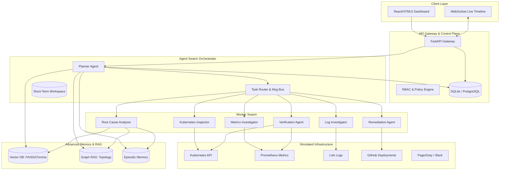
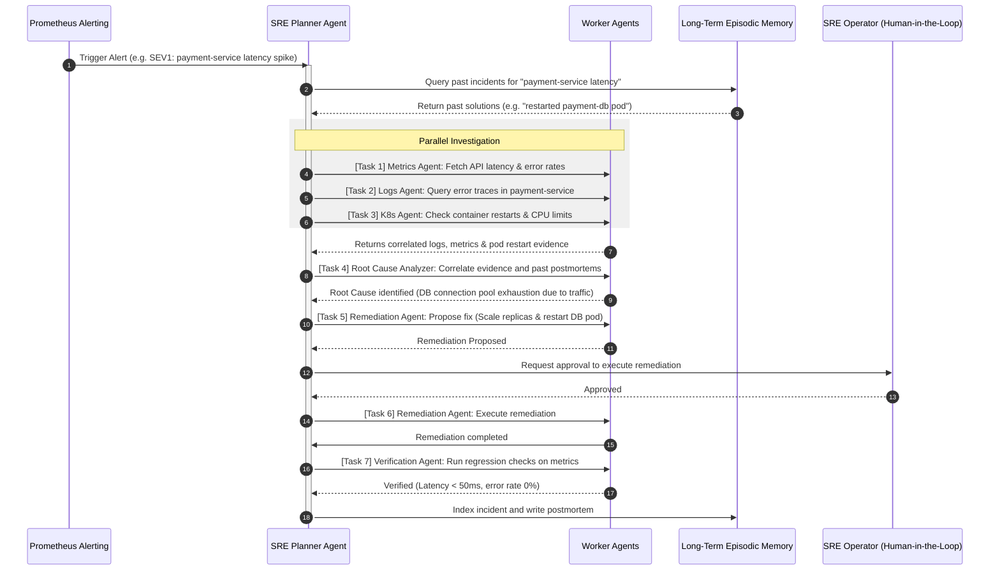

# AIRE: Autonomous Incident Response Engineer

AIRE is a production-grade, highly autonomous Site Reliability Engineering (SRE) platform. It behaves like an experienced SRE at scale, detecting outages, correlating logs/metrics, inspecting simulated Kubernetes workloads, executing safe remediations, drafting postmortems, and continuously learning from past failures.

## 🏛️ System Architecture



---

## 🤖 Collaborative Agent Swarm Flow

Rather than a simple sequential pipeline, AIRE implements an **asynchronous event-driven agent swarm**. The **Planner Agent** acts as the dispatcher, dividing the problem into structured sub-tasks and routing them via a task-status state machine.



---

## 📂 Project Directory Structure

```text
aire/
├── backend/
│   ├── main.py              # FastAPI entrypoint, websocket handlers
│   ├── core/
│   │   ├── config.py        # Global settings, security redaction parameters
│   │   ├── security.py      # RBAC, injection filters, human approval gates
│   │   └── models.py        # Typed Pydantic data schemas
│   ├── agents/
│   │   ├── orchestrator.py  # SRE Planner Agent logic
│   │   ├── swarm.py         # Sub-agents (Logs, Metrics, Root Cause, Remediation)
│   │   └── tools.py         # SRE Client APIs (Prometheus, Loki, K8s, GitHub)
│   ├── memory/
│   │   ├── rag.py           # Hybrid & Graph RAG implementation
│   │   └── episodic.py      # Past incident memory recall
│   ├── simulation/
│   │   ├── mock_services.py # Mock timeseries data & pod container status generators
│   │   └── incident_generator.py # Simulators for PodCrash, LatencySpike, CanaryFailed
│   ├── evaluation/
│   │   └── evaluator.py     # Golden dataset scoring & performance evaluation
│   └── tests/               # Pytest suite
├── frontend/
│   ├── index.html           # Glassmorphic central dashboard UI
│   ├── style.css            # Dark variables, transitions, layouts
│   └── app.js               # Event-based Websocket updates
└── README.md                # System design & Documentation hub
```

---

## 🛠️ Setup & Running

Instructions on running the backend server and dashboard locally:

1. **Install requirements**:
   ```bash
   pip install fastapi uvicorn pydantic-settings jinja2 pytest
   ```
2. **Start the backend control plane**:
   ```bash
   python backend/main.py
   ```
3. **Open the frontend**:
   Open `frontend/index.html` in your browser to view the real-time agent dashboard.
