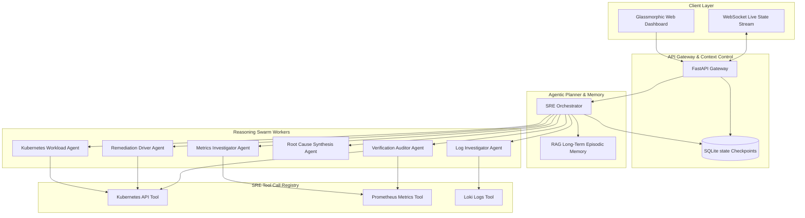
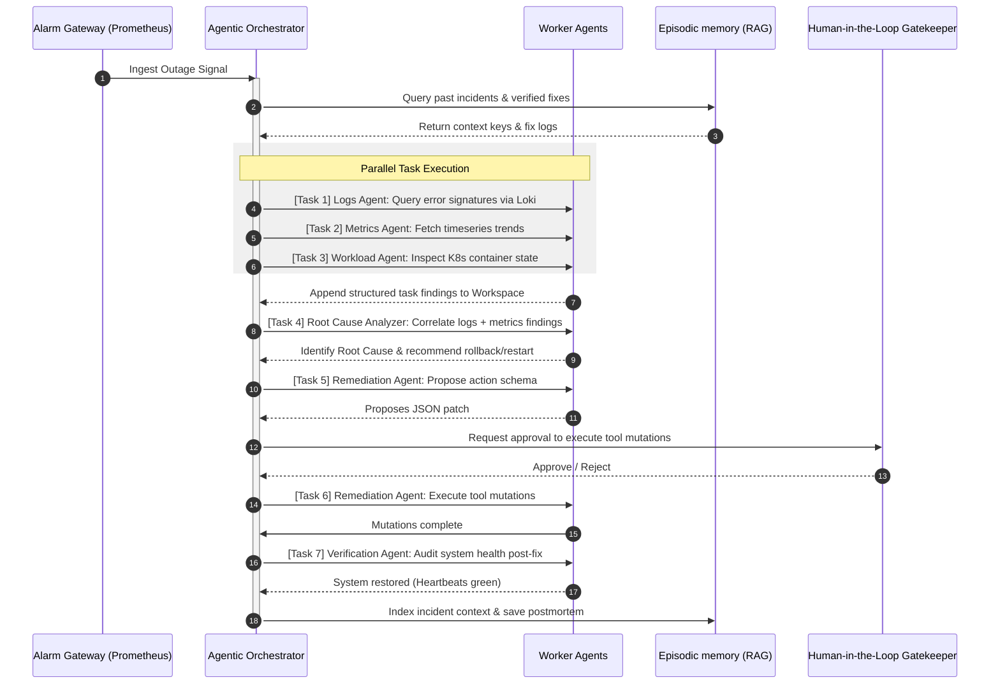

# AIRE: Multi-Agent AI Orchestration & Autonomous Agentic Workflows Platform

AIRE is a production-grade Agentic AI Orchestration Platform. It implements a collaborative swarm of specialized reasoning agents (Log Investigator, Metrics Analyzer, Kubernetes Workload Auditor, and Root Cause Reasoner) that dynamically plan, communicate, call tools, and solve complex multi-step problems inside an isolated workspace.

Rather than simple sequential pipelines, AIRE serves as a flagship demonstration of building **reliable, production-ready Agentic Systems** that execute multi-step planning, function calling, episodic memory retrieval, and self-evaluation.

---

## 🧠 Core Agentic AI Architectures

Review the deep technical specifications detailing how the agentic systems are constructed:

* **[PROMPT_ENGINEERING.md](file:///C:/Users/KALYAN/.gemini/antigravity/scratch/aire/docs/ai/PROMPT_ENGINEERING.md)**: Details structured JSON configurations, prompt boundary controls, and hybrid RAG episodic memory retrieval.
* **[ARCHITECTURE.md](file:///C:/Users/KALYAN/.gemini/antigravity/scratch/aire/docs/architecture/ARCHITECTURE.md)**: Documents the system thread pools, SQLAlchemy database checkpointing, and non-blocking executors.

---

## 🏛️ Agentic Swarm Architecture Diagram



---

## 🤖 Dynamic Swarm Coordination Lifecycle



---

## 📂 Project Directory structure

```text
aire/
├── backend/
│   ├── main.py              # API Gateway, WebSocket events, static dashboard server
│   ├── core/
│   │   ├── config.py        # System configurations & model identifiers
│   │   ├── security.py      # RBAC authorizations, prompt injection filters, secrets redaction
│   │   └── models.py        # SQLAlchemy schema mappings & state checkpoints
│   ├── agents/
│   │   ├── orchestrator.py  # Thread-safe agent context coordinator
│   │   ├── swarm.py         # Swarm workers (Logs, Metrics, Root Cause, Remediation)
│   │   └── tools.py         # Unified Tool Call Registry
│   ├── memory/
│   │   ├── rag.py           # Hybrid episodic memory search and lookup
│   │   └── episodic.py      # Long-term memory stores
│   ├── simulation/
│   │   ├── mock_services.py # Mock metrics and pod status generators
│   │   └── incident_generator.py # simulated outage scenarios
│   ├── evaluation/
│   │   └── evaluator.py     # Accuracy, precision, and faithfulness evaluations
│   └── tests/
│       └── test_sre.py      # Pytest suite verifying WAL checkpoints and rate limits
├── frontend/
│   ├── index.html           # Dark glassmorphic workflow telemetry dashboard
│   ├── style.css            # Dark variables and responsive layouts
│   └── app.js               # Websocket live listeners & action handlers
├── docs/                    # Evolved System Engineering specs directory
│   ├── architecture/        # ARCHITECTURE.md spec sheet
│   ├── ai/                  # PROMPT_ENGINEERING.md evaluation logs
│   ├── security/            # SECURITY.md threat models
│   └── adr/                 # Architectural Decision Records (ADR 001 - 003)
└── README.md                # Global documentation index
```

---

## 🛠️ Setup & Execution

### 1. Installation
Install core requirements:
```bash
pip install fastapi uvicorn pydantic-settings sqlalchemy slowapi pytest httpx
```

### 2. Start the Backend API & Server
Run the following command in the project directory:
```bash
python -m backend.main
```

### 3. Open the Telemetry Dashboard
Open your browser and navigate to:
**`http://127.0.0.1:8080/`**
*(The FastAPI server automatically serves the dashboard index assets).*

### 4. Running the Pytest Suite
Execute automated database concurrency, rate-limiter, and agent lifecycle checks:
```bash
python -m pytest backend/tests/test_sre.py
```
