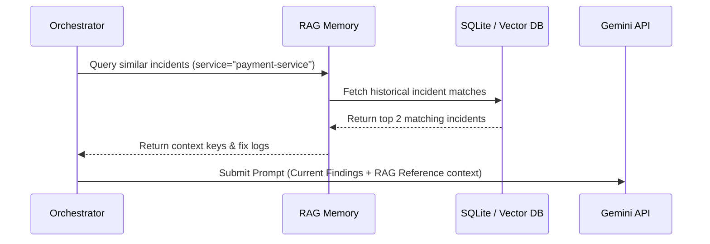

# AIRE Swarm: AI Systems & Prompt Engineering Specification

This document details the LLM prompt design, dynamic context management, RAG long-term memory retrieval, structured outputs, and the automated evaluation pipeline of the AIRE swarm.

---

## 1. Prompt Design & Structured JSON Output

The `RootCauseAnalyzer` agent prompts the LLM to analyze aggregated logs, metrics, and network topologies, returning structured JSON containing both the root cause and the remediation actions.

```text
System Prompt:
You are a Principal SRE at Google. Analyze the following cluster diagnostic findings and determine the root cause and the best remediation action.

Findings:
{findings_summary}

Format your response as a JSON object with exactly two keys:
"root_cause": <string describing root cause>
"remediation": <string describing remediation command action e.g. restart or rollback>

Ensure your output is valid JSON.
```

### Structured Output Safeguard:
To ensure JSON compatibility, the API call incorporates the Gemini REST parameter `"responseMimeType": "application/json"`. This instructs the model's decoding layers to strictly generate characters conforming to JSON key-value formatting, eliminating syntax truncation crashes.

---

## 2. RAG Long-Term Memory & Context Retrieval

To assist the Swarm in diagnosing recurrent failures, AIRE implements an incident context retrieval module (`backend/memory/rag.py`).



* **Context Injection**: Historical incident details (trigger, root cause, and successful fixes) are retrieved and injected into the prompt.
* **Token Cost Optimization**: Instead of passing the entire historical postmortem, only the core metadata, root cause summary, and execution actions are injected.

---

## 3. Automated Evaluation Pipeline

AIRE contains a dedicated pipeline (`backend/evaluation/evaluator.py`) that scores agent run outputs against golden test datasets:

1. **Precision & Recall**: Evaluates whether the identified root cause includes key fault concepts (e.g. `OOMKilled` vs `Connection Slots`).
2. **Faithfulness**: Scores whether the agent's proposed remediation is supported by cluster observations, penalizing hallucinations.
3. **Hallucination Rate**: Detects unrecognized commands or service references.
4. **Latency & Cost Logs**: Measures token costs in USD and tracking end-to-end execution latency in seconds to measure SRE ROI metrics.
