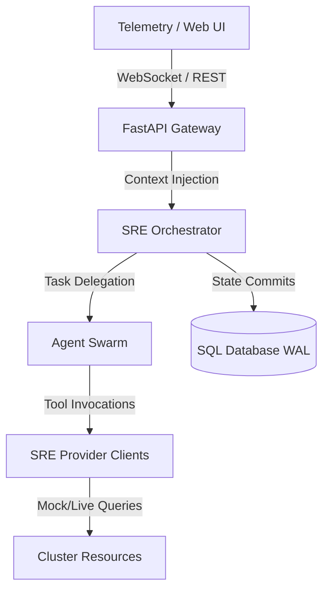

# AIRE Control Plane: Architecture Specification

This document details the architectural design, system decomposition, module boundaries, and thread-safety design of the AIRE Autonomous Incident Response Engineer Platform.

---

## 1. System Decomposition & Data Flow

AIRE is designed as a modular control plane that acts as a bridge between active telemetry infrastructure (Kubernetes, Loki, Prometheus) and an autonomous reasoning swarm.



### Module Boundaries:
1. **API Gateway (`backend/main.py`)**: Entry point handling CORS, rate-limiting, liveness probes, WebSocket sessions, and request whitelisting.
2. **SRE Orchestrator (`backend/agents/orchestrator.py`)**: Central workflow state machine coordinating detection, investigation, remediation execution, verification, and postmortem loops.
3. **Agent Swarm (`backend/agents/swarm.py`)**: Specialized reasoning agents (LogInvestigator, MetricsInvestigator, KubernetesInspector, RootCauseAnalyzer) executing narrow diagnostic sub-tasks.
4. **SRE Provider Clients (`backend/agents/tools.py`)**: Abstract client integrations communicating with cluster APIs.
5. **Database Layer (`backend/core/models.py`)**: SQLite storage utilizing SQLAlchemy ORM mapping with WAL-mode concurrency control.

---

## 2. Database Concurrency & SQLite WAL Design

SQLite by default locks the entire database file during writes, which crashes under concurrent multi-agent executions. To resolve this:

1. **Write-Ahead Logging (WAL)**: Enabled by default to allow concurrent readers and a single writer executing simultaneously without locking blocks.
2. **SQLAlchemy Event Listeners**:
   ```python
   @event.listens_for(engine, "connect")
   def set_sqlite_pragma(dbapi_connection, connection_record):
       cursor = dbapi_connection.cursor()
       cursor.execute("PRAGMA journal_mode=WAL")
       cursor.execute("PRAGMA synchronous=NORMAL")
       cursor.close()
   ```
3. **Idempotent CRUD Operations**: All write operations check database state via unique keys and perform safe upserts (merge) to avoid primary key constraints during parallel thread retries.

---

## 3. Non-Blocking Async Thread Management

The API Gateway runs on an asynchronous event loop (`asyncio`). However, standard SRE tool queries (e.g. searching Lokis, checking Prometheus metrics) make network calls that block execution threads.

* **Thread Pool Delegation**: Sync diagnostic loops are wrapped inside `asyncio.to_thread` executors. This delegates blocking tasks to a thread pool, keeping the main loop fully available to serve incoming client WebSockets.
* **WebSocket Broadcast Manager**: Thread-safe listeners broadcast real-time incident modifications directly to connected browser clients without blocking thread telemetry pools.
