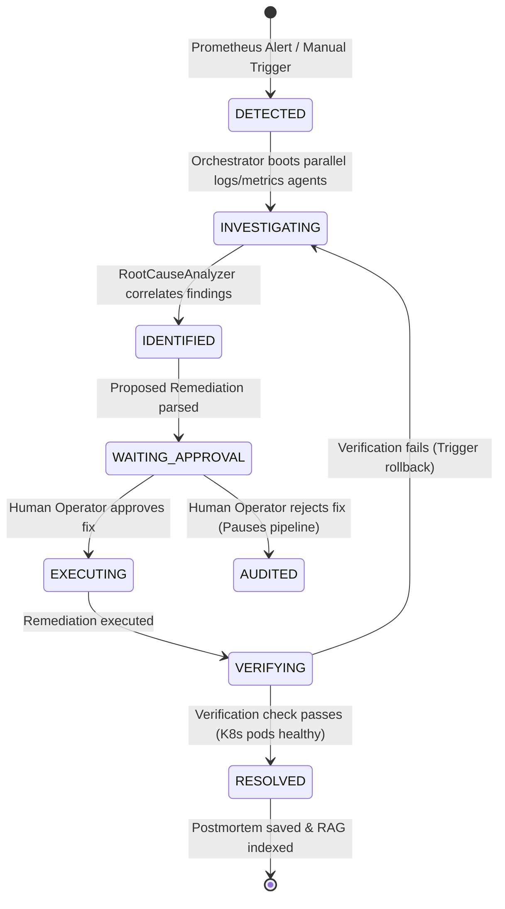

# AIRE Platform: Agentic Infrastructure Specification

This document defines the agent coordination workflows, short-term work space isolation, tool-calling abstractions, and vector memory synchronization of the AIRE control plane.

---

## 1. Agent Coordination & Workflow Lifecycle

AIRE is powered by an asynchronous **SRE Orchestrator** acting as the central state coordinator, governing the execution lifecycle of worker sub-agents:

---

## 2. Tool Registry & Function Calling Abstractions

Worker agents do not interact with cluster APIs directly. They invoke methods through a unified SRE Tool interface in `backend/agents/tools.py`.

* **Structured Tool Schema**: Tools are defined with typed argument signatures, enabling automated validation before execution.
* **Redaction Pipeline**: Tool results pass through the `SecurityManager` secrets redaction filter before being appended to the agent's short-term task findings, ensuring no raw tokens leak to the LLM context.
* **Non-Blocking Execution**: System commands and HTTP REST calls execute inside `asyncio.to_thread` pools to keep the event loop free.

---

## 3. Short-Term Workspace & Memory Lifecycle

Each incident creates an isolated execution workspace (`context` dictionary map):

1. **Short-Term Memory**: Stores diagnostic findings from the `LogInvestigator`, `MetricsInvestigator`, and `KubernetesInspector`.
2. **Context Compression**: When worker logs exceed token guidelines, the `LogInvestigator` extracts only the matching error signatures, dropping verbose debug spam.
3. **Long-Term Episodic Memory (RAG)**: Relies on `backend/memory/rag.py` to fetch verified root causes and fixes from matching historical incident schemas, injecting past successes directly into the prompt.
