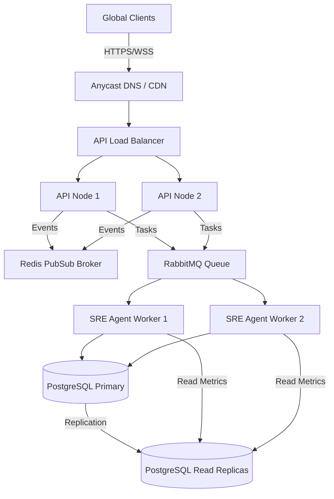

# AIRE Control Plane: System Design & Scaling Specifications

This document outlines the scaling path, bottlenecks, infrastructure redesigns, and operational risk mitigation for the AIRE platform under various levels of concurrent user load.

---

## 1. Scale-Level Analysis & Bottlenecks

### 👥 Scale 100 to 1,000 Users
* **Bottlenecks**: SQLite file lock queues and single-process FastAPI WebSockets.
* **Architecture Change**:
  * Migrate database from SQLite to **PostgreSQL**.
  * Use **SQLAlchemy connection pools** to reuse DB connections.
  * Run FastAPI under multiple worker processes using **Gunicorn/Uvicorn**.

### 👥 Scale 10,000 Users
* **Bottlenecks**: WebSocket connection exhaustion. A single node runs out of file descriptors when keeping 10,000 parallel WebSocket channels open.
* **Architecture Change**:
  * Introduce **Redis PubSub** as an event broker.
  * Deploy multiple API nodes behind an **NGINX / HAProxy Load Balancer**.
  * Scale WebSocket connections horizontally across API instances; Redis broadcasts state modifications page-wide.

### 👥 Scale 100,000 Users
* **Bottlenecks**: Agent execution latency. Running Swarm reasoning pipelines inside the web server process blocks HTTP execution threads.
* **Architecture Change**:
  * Decouple execution from API workers using a distributed task broker (**Celery + RabbitMQ / Amazon SQS**).
  * API endpoints submit incident IDs to the message queue; independent **Celery Workers** pull tasks and execute agent logic asynchronously.

### 👥 Scale 1,000,000 Users
* **Bottlenecks**: High database read load on telemetry and audit history, and API rate-limiting thresholds.
* **Architecture Change**:
  * Migrate to a **distributed PostgreSQL cluster** with one writer and multiple read-replicas.
  * Introduce **Redis Caching** for historical postmortem lists and static dashboard layouts.
  * Move telemetry ingestion to **Apache Kafka** to buffer metric spikes before writing to storage.

---

## 2. Horizontal Scaling System Architecture

---

## 3. High Availability & Failure Recovery (DR)

1. **Database Multi-AZ Failover**: PostgreSQL configured in Primary-Standby setup with automated health monitors (e.g. AWS Aurora) performing failover in < 30 seconds.
2. **WebSocket Keep-Alives**: Frontend clients send heartbeat pings every 30s. If connection drops, frontend triggers an exponential backoff reconnect, querying `/api/incidents` to resync state.
3. **Dead Letter Queues (DLQ)**: Failed agent tasks are routed to a DLQ after 3 retries, raising a SEV1 SRE alert for manual engineer review.
